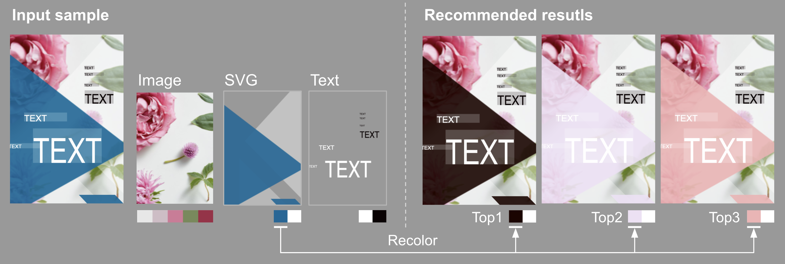

# Color recommendation for vector graphic documents 

Official implementation of [Color Recommendation for Vector Graphic Documents based on Multi-Palette Representation](https://arxiv.org/abs/2209.10820)



## Prerequisites

- Python:3.8
- Poetry: 1.2.*

## Setup

Install requirements and run jupyter.

```
poetry install
poetry run jupyter lab
```

## Quick demo

`notebooks/recomm_colors.ipynb`: recommend colors for multiple palettes in a design
- Trained model of color prediction are in trained_models/.
- Json files for test are pre-created in data/model_test_input/crello_samples/.

You can train a color model on a notebook `notebooks/train_model.ipynb`. We recommended GPU resources to train this model (e.g. Tesla T4 * 1).
You can also create a json file for test from crello dataset on a notebook `notebooks/create_json_file.ipynb`.

## Data

`data/training_data/metadata_colors`: extracted color palettes for Image-SVG-Text elements from [Crello-dataset-v1](https://storage.googleapis.com/ailab-public/canvas-vae/crello-dataset-v1.zip) ([the lastest Crello-dataset](https://github.com/CyberAgentAILab/canvas-vae/blob/main/docs/crello-dataset.md))

`data/training_data/data_bert/data_color`: color corpus of train, validation, and test dataset, and color vocabulary from train dataset

`data/trained_models`: trained model for color recommendation

`model_test_input`: json sample files for testing the results of color recommendation

## Citation

```bibtex
@misc{Qiu_2022,
  author = {Qiu Qianru, Wang Xueting, Otani Mayu, and Iwazaki Yuki},
  title = {Color Recommendation for Vector Graphic Documents based on Multi-Palette Representation},  
  doi = {10.48550/ARXIV.2209.10820},  
  url = {https://arxiv.org/abs/2209.10820},  
  year = {2022},
}
```
